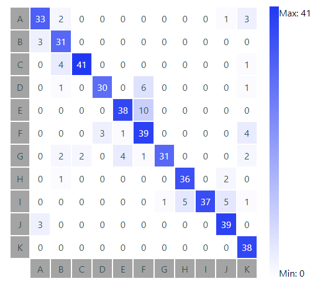

# REACT CONFUSION MATRIX



## :hammer_and_wrench: Installation
Install it from npm and include it in your React build process (using [Webpack](http://webpack.github.io/), [Browserify](http://browserify.org/), etc).

```bash
npm install --save react-confusion-matrix
```
or:
```bash
yarn add react-confusion-matrix
```


## :computer: Usage
To use the component, you need to provide the data (a bidimensional array) and labels (array).

-Example of data array:
```js
const dataArray = [
  [33, 2, 0, 0, 0, 0, 0, 0, 0, 1, 3],
  [3, 31, 0, 0, 0, 0, 0, 0, 0, 0, 0],
  [0, 4, 41, 0, 0, 0, 0, 0, 0, 0, 1],
  [0, 1, 0, 30, 0, 6, 0, 0, 0, 0, 1],
  [0, 0, 0, 0, 38, 10, 0, 0, 0, 0, 0],
  [0, 0, 0, 3, 1, 39, 0, 0, 0, 0, 4],
  [0, 2, 2, 0, 4, 1, 31, 0, 0, 0, 2],
  [0, 1, 0, 0, 0, 0, 0, 36, 0, 2, 0],
  [0, 0, 0, 0, 0, 0, 1, 5, 37, 5, 1],
  [3, 0, 0, 0, 0, 0, 0, 0, 0, 39, 0],
  [0, 0, 0, 0, 0, 0, 0, 0, 0, 0, 38],
];
```

-Example of data array:
```js
  const labelsArray = ["A", "B", "C", "D", "E", "F", "G", "H", "I", "J", "K"];
```

-Example of usage:
```jsx static
import React from 'react'
import {ConfusionMatrix} from 'react-confusion-matrix'

function MyApp(props) {
  const {dataArray, labelsArray} = props;

  return (
    <div>
      <ConfusionMatrix data={dataArray} labels={labelsArray} />
    </div>
  )
}
```

-Also, you can use the minBg, maxBg and labelBg props to modify the colors of the component.

<!-- ## :sparkles: Contribute

All the guidelines are available at the [contributing](CONTRIBUTING.md) file, so make sure that your code and
documentation follow all the instructions there before completing any contribution.

:warning: Work in progress. -->

## :bug: Issues and requests

All the issues and feature requests must be created at the [issue](https://github.com/MiguelPerezMartinez/react-confusion-matrix/issues) 
section of the official ENAIA repository, and all the following discussions will be handled there.